# OrgPortal — B2B Organization Portal for FreeScout


**OrgPortal** turns FreeScout into a full-featured **B2B helpdesk platform**. Instead of treating every customer as an individual, you work with *companies* — with roles, hierarchies, shared visibility, and a self-service portal your corporate clients actually want to use.

Built for teams that support other businesses, not just individual users.

**Minimum FreeScout version:** 1.8.147  
**Optional integrations:** [End-User Portal](https://freescout.net/module/end-user-portal/), [API and Webhooks](https://freescout.net/module/api-webhooks/), [Kanban](https://freescout.net/module/kanban/)

---

🌐 **Also available in:**
[Українська](docs/README.uk.md) ·
[Deutsch](docs/README.de.md) ·
[Français](docs/README.fr.md) ·
[Español](docs/README.es.md) ·
[Italiano](docs/README.it.md) ·
[Polski](docs/README.pl.md) ·
[Čeština](docs/README.cs.md) ·
[Slovenčina](docs/README.sk.md) ·
[Nederlands](docs/README.nl.md) ·
[Norsk](docs/README.no.md) ·
[Dansk](docs/README.da.md) ·
[Svenska](docs/README.sv.md) ·
[Suomi](docs/README.fi.md) ·
[Português (BR)](docs/README.pt-BR.md) ·
[Português (PT)](docs/README.pt-PT.md) ·
[Română](docs/README.ro.md) ·
[中文 (简体)](docs/README.zh-CN.md)

---

## What changes with OrgPortal

Without OrgPortal, FreeScout sees customers — individual people who send emails. Your team has no way to know that Alice, Bob, and Carol all work at Acme Corp, or that Alice is the account manager who should see every ticket, while Carol can only see her own.

With OrgPortal:

- Every customer belongs to a **company (organization)**
- Companies have **departments** with scoped access
- Corporate managers get their **own self-service portal** — view all company tickets, reply, close, reassign authors, manage notification preferences
- Your team sees the **org badge** on every ticket and Kanban card — no hunting for context
- Every ticket is permanently attributed to its organization at creation time — **historical reporting never breaks**
- Everything is **API-driven** — connect your CRM, automate onboarding, sync memberships

---

## Organizations

*One place for everything about a corporate account.*

- **Manage → Organizations** — create, edit, delete, activate/deactivate organizations
- **Live search** — filter the list in real time by name
- **Color-coded badges** — 12 colors; badge appears on tickets and Kanban cards for instant visual identification
- Clickable badge opens an instant search for all tickets from that organization
- **Mailbox binding** — organizations can be global (all mailboxes) or scoped to one mailbox
- **Activate / deactivate** — suspend an account without losing any history
- **Tags** — assign FreeScout tags to organizations; visible in the org list and manageable via API
- **Ticket count** — total open tickets per organization shown directly in the list
- **Organization filter** in standard FreeScout search — one click finds every ticket from a corporate account
- Organization name, structural unit, and member role shown in the admin ticket sidebar

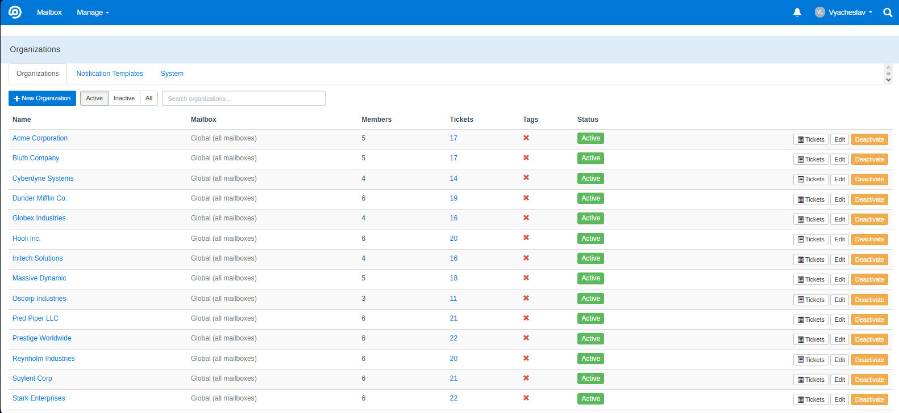

---

## Structural Units — Department-Level Access Control

*Support large enterprises with complex internal hierarchies.*

Organizations can be divided into unlimited **structural units** (departments, branches, regional offices, project teams):

- Create, rename, and delete units directly in the organization edit form
- Assign members to units — each member belongs to one unit

**Three role levels:**

| Role | Access scope |
|------|-------------|
| `member` | Own tickets only |
| `unit_manager` | All tickets within their structural unit |
| `manager` (global) | All tickets across the entire organization |

- Unit managers have full portal capabilities — replies, attachments, author reassignment, close/reopen, notification management — scoped strictly to their unit
- Ticket access and notification delivery are enforced at unit boundaries

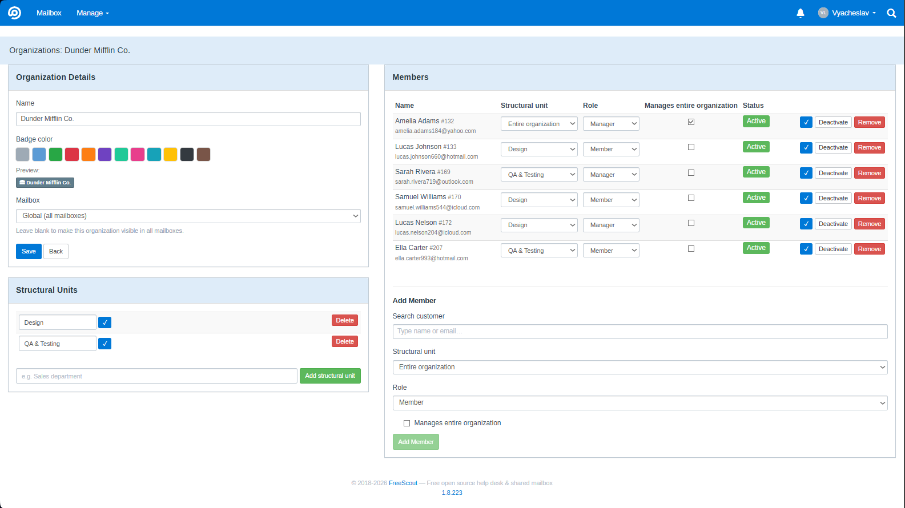

---

## Org Snapshot — Permanent Ticket Attribution

*Reliable historical reporting even as your client roster changes.*

When a ticket is created, OrgPortal automatically records the organization context as a permanent snapshot:

- `org_id`, `org_unit_id`, and `org_attributed_at` are written to the conversation at creation time
- **Immutable** — if a customer later leaves an organization, their historical tickets remain attributed to that org; reporting never breaks
- Attribution source is configurable: via organization membership or direct customer assignment
- **Backfill existing tickets** with `php artisan orgportal:backfill-attribution`
- Snapshot visibility and reset controls in admin settings

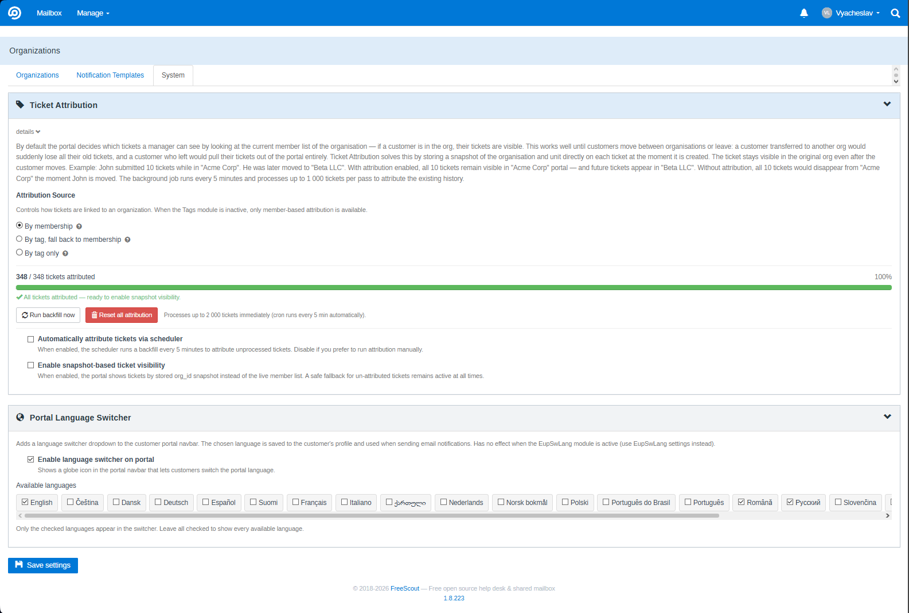

---

## Kanban Integration

*Keep your visual workflow aligned with your B2B accounts.*

- Organization badge on every Kanban card with the account's assigned color
- **Organization filter** in the Kanban filter panel — multi-select modal with checkboxes; filter state persists across navigation
- **Multilingual Kanban status filter labels** — give each Kanban column a custom name per portal language; switch locales with the language picker in per-mailbox settings; drag to reorder filters
- Translated labels appear in both the portal filter bar and the **State** column of the company tickets table; fallback chain: saved locale → saved English → original column name

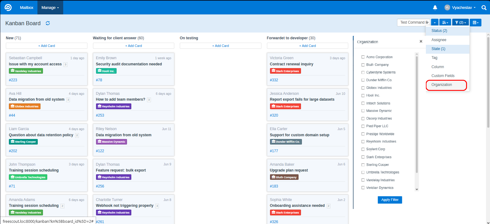

---

## Access Control & Permissions

*Delegate organization management without granting admin access.*

- **"Allow managing organizations"** — support team leads can manage corporate accounts without admin rights
- **"Allow managing notification templates"** — separate granular permission for template editing
- Deleting organizations remains exclusively admin-only
- Portal access is strictly scoped per mailbox: a manager from Organization A cannot access Organization B

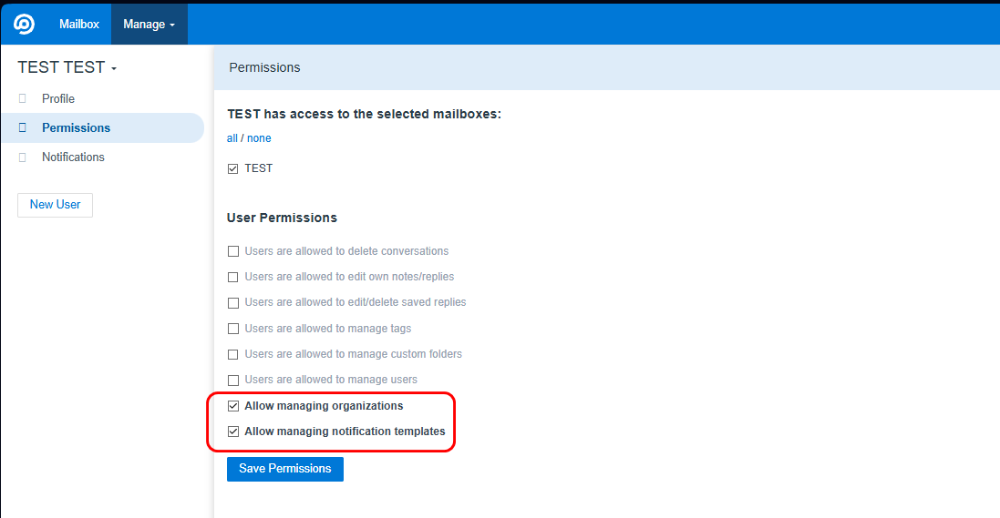

---

## End-User Portal — Self-Service for Corporate Managers *(optional)*

*Give your B2B clients a portal where they manage their company's support relationship — without contacting your team for every status update.*

Requires the [End-User Portal](https://freescout.net/module/end-user-portal/) module.

### Company Tickets Dashboard

A dedicated **Company Tickets** section in portal navigation with a full-featured ticket table:

| Column | Description |
|--------|-------------|
| **#** | Ticket ID |
| **Subject** | Truncated with tooltip on hover |
| **Responsible** | Assigned support agent |
| **Author** | Customer who opened the ticket; click to filter by this author |
| **Status** | Active / Pending / Closed / Spam with icons |
| **State** | Kanban column name in the current portal language (only when Kanban module is active) |
| **Updated** | Date and time of last reply |

**Two independent read indicators per row:**
- **Bold row** — manager has unread notifications for this conversation
- **👁 Eye icon** — the ticket author has not yet opened the latest agent reply

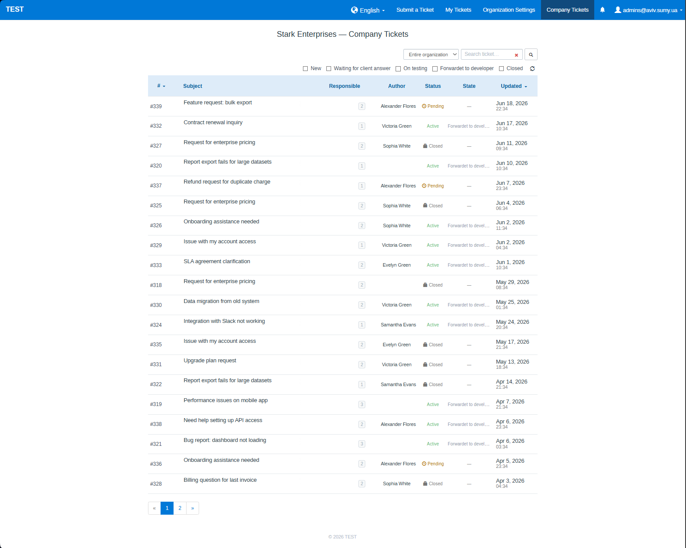

### Ticket Actions in the Portal

Managers can take action directly — no need to contact support:

- **Reply with attachments** — drag & drop, multiple files per reply
- **Close ticket** — a new reply automatically reopens it
- **Change ticket author** — reassign a ticket to another organization member
- **Filter by unit** — global managers filter the ticket list by structural unit
- **Filter by Kanban status** — configurable per mailbox, labels shown in the current portal language

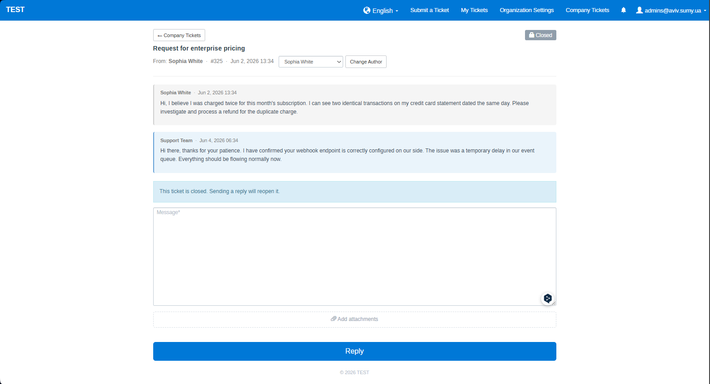

### Manager Viewed Tracking

- A **"viewed"** note appears under agent replies in the admin ticket view when a manager opens the ticket in the portal
- Shows manager name, role (Organization manager / Unit manager), and time elapsed
- Global manager and unit manager views tracked and displayed independently — same UX as FreeScout's native "Customer viewed"

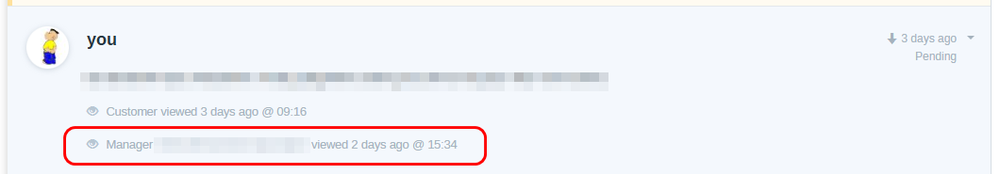

---

## Real-Time Notification Bell *(optional)*

*Keep managers informed the moment something happens with their company's tickets.*

Requires the [End-User Portal](https://freescout.net/module/end-user-portal/) module.

- 🔔 Bell icon with live unread count badge in the EUP navbar
- Notifications for: **new ticket**, **agent reply**, **customer reply** — for all manager roles
- Dropdown panel with notifications grouped by date: actor name, event type, ticket number, message preview, timestamp
- **Auto-mark as read** when the manager opens the ticket
- Mark individual notifications read via ×; **Mark all as read** in panel header
- Polls every 15 seconds; refreshes on browser back/forward navigation (bfcache-aware)


---

## Notification Subscriptions *(optional)*

*Let managers decide what they hear about — nothing more, nothing less.*

- **Visual subscription matrix** on the "Notifications" tab in portal Organization Settings
- **Three event types:** New ticket · Agent reply · Customer reply
- **Two scope levels:** Entire organization (global managers) · Individual structural units
- **Per-member overrides** — expand any unit row to reveal individual members and toggle their subscriptions inline
- **Cascaded logic in both directions:**
  - Enabling "Entire organization" → enables all units and all members
  - Enabling a unit → enables all its members
  - Disabling a member → auto-reconciles the unit and organization checkboxes
- Global managers manage all members; unit managers manage only their own unit
- Notifications use the mail driver of the corresponding mailbox

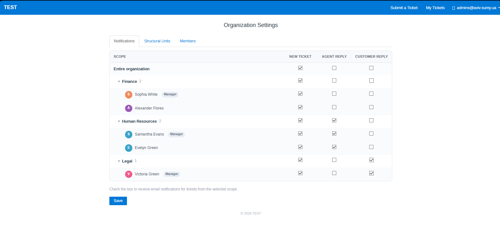

---

## Multilingual Notification Email Templates *(optional)*

*Your corporate clients receive support emails in their own language — automatically, with no manual effort.*

- **Per-locale templates** — separate subject and body for each portal language; switch between them with the locale dropdown in the admin template editor
- **Summernote WYSIWYG editor** for rich HTML email composition
- **Macro variable picker** — insert placeholders with one click
- **19 built-in default templates** — ready to use out of the box; no configuration needed

**Available macro variables:**

| Variable | Description |
|----------|-------------|
| `{manager_name}` | Name of the manager receiving the notification |
| `{author_name}` | Customer who created or replied to the ticket |
| `{org_name}` | Organization name |
| `{unit_name}` | Structural unit name |
| `{subject}` | Ticket subject |
| `{ticket_number}` | Ticket ID |
| `{ticket_url}` | Direct link to the ticket in the portal |
| `{ticket_text}` | Full text of the initial message (HTML) |
| `{reply_text}` | Full text of the latest reply (HTML) |
| `{created_datetime}` | Ticket creation date and time |
| `{reply_datetime}` | Reply date and time |

**Fallback chain:** saved locale template → built-in locale template → saved English template → built-in English template

Notification language is determined by each manager's portal language selection, saved automatically when they use the language switcher.

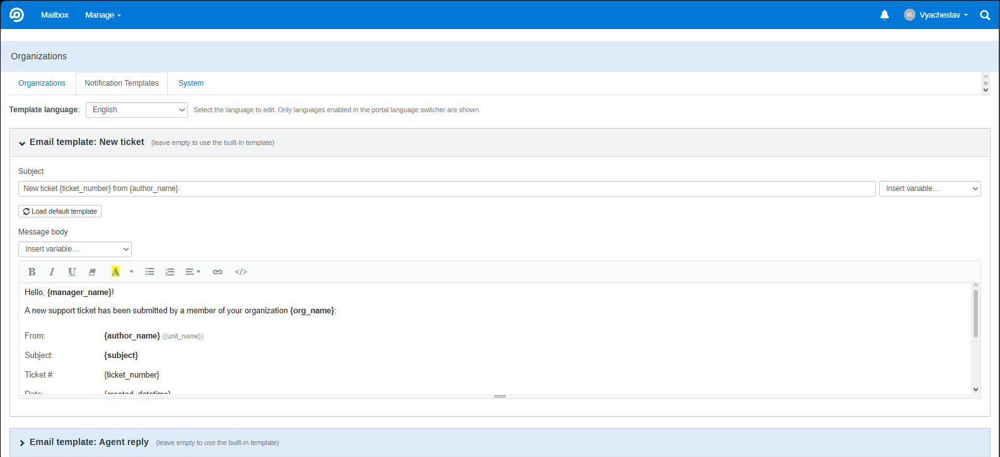

---

## REST API *(optional)*

*Integrate OrgPortal into your CRM, ERP, or customer onboarding workflow.*

Requires the [API and Webhooks](https://freescout.net/module/api-webhooks/) module.

- Full CRUD for organizations, structural units, customer memberships, and tags
- **Organization fields:** `name`, `color`, `mailboxId`, `isActive` — all readable and updatable via API
- **Members sub-resource** — `GET/PUT/DELETE /api/organizations/{id}/members/{memberId}` — update role, unit, `canManageOrg`, and per-member `isActive` flag independently without touching the rest of the membership
- **Tags sub-resource** — `GET/PUT /api/organizations/{id}/tags` — list or fully replace tag bindings (requires Tags module; returns `503` if inactive)
- Authentication via `X-FreeScout-API-Key` header or `api_key` query parameter
- Interactive **ReDoc documentation** at **Manage → API & Webhooks → OrgPortal API Docs** (`/orgportal/admin/api-docs`)

📖 **Full API reference → [docs/api/README.md](docs/api/README.md)**

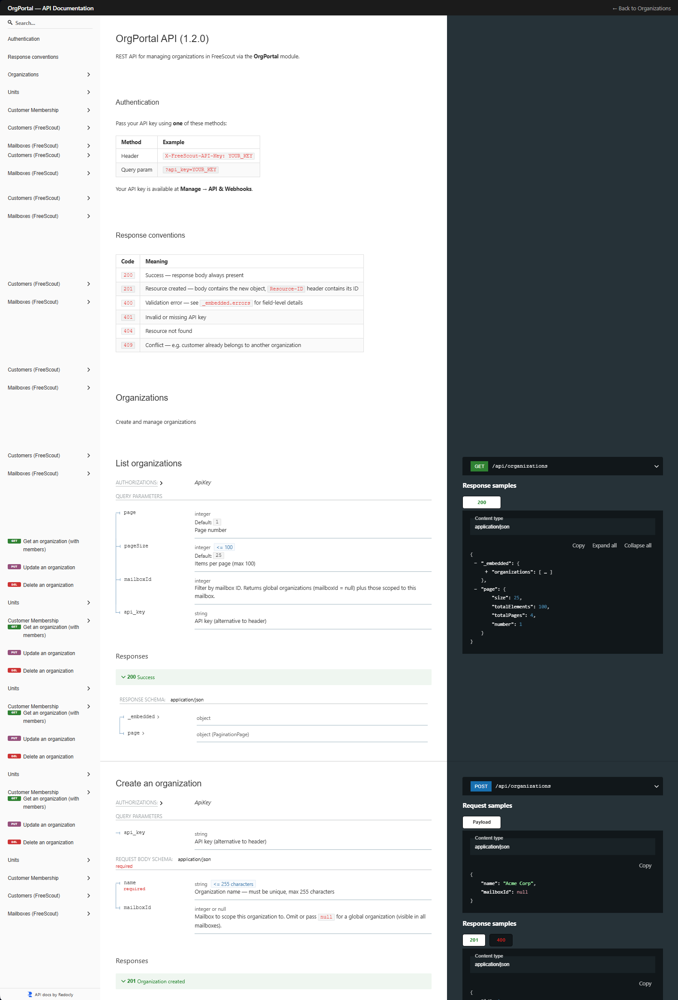

---

## Installation

1. Copy the `OrgPortal` folder into `Modules/` of your FreeScout installation
2. Go to **Manage → Modules → OrgPortal → Activate**
3. Run migrations:
   ```bash
   php artisan module:migrate OrgPortal
   ```
4. Clear cache:
   ```bash
   php artisan cache:clear && php artisan config:clear
   ```

> **Georgian language support** is deployed automatically on first boot — no manual file copying required.

---

## Automatic Updates

OrgPortal supports **one-click updates** via FreeScout's built-in module update mechanism.

> **Requires FreeScout 1.8.170 or later.** On older versions, update manually by replacing the `OrgPortal` folder with the latest release ZIP.

When a new version is available, a banner appears on **Manage → Modules**. Click **Update now** — FreeScout downloads and installs the latest version automatically.

---

## Module Compatibility

| Module | Status | Notes |
|--------|--------|-------|
| End-User Portal ≥ 1.0.85 | Optional | Manager portal, notification bell, subscriptions |
| API and Webhooks ≥ 1.0.80 | Optional | REST API endpoints |
| Kanban ≥ 1.0.23 | Optional | Badge on cards, org filter, multilingual State column labels |
| Custom Fields | ✅ Compatible | — |
| Workflows | ✅ Compatible | — |
| Tags | ✅ Compatible | Tag bindings manageable via API (`/organizations/{id}/tags`) |

---

## Configuration

### Global Settings — **Manage → OrgPortal Settings**

| Option | Default | Description |
|--------|---------|-------------|
| Show badge on ticket page | ✅ Enabled | Org badge in conversation list and ticket view |
| Show badge on Kanban cards | ✅ Enabled | Org badge on Kanban board cards |
| Org snapshot visibility | Enabled | Show/hide attribution data in ticket sidebar |
| Attribution source | Member | How tickets are attributed to organizations |

### Per-Mailbox Settings — **Mailbox Settings → OrgPortal**

Overrides global values for the specific mailbox.

| Option | Description |
|--------|-------------|
| Show badge on ticket page | Enable/disable badge for this mailbox |
| Show badge on Kanban cards | Enable/disable badge for this mailbox |
| Show organization block in customer profile | Toggle org info in the ticket sidebar |
| Company ticket status filters | Map Kanban columns to named filters visible in the portal; supports per-language labels with a locale switcher; drag to reorder |

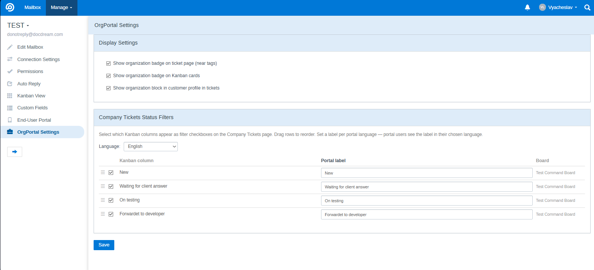

---

## Translations

OrgPortal is fully localized in **19 languages**:

| Language | Code | Language | Code |
|----------|------|----------|------|
| English | `en` | Dutch | `nl` |
| Ukrainian | `uk` | Norwegian | `no` |
| German | `de` | Danish | `da` |
| French | `fr` | Swedish | `sv` |
| Spanish | `es` | Finnish | `fi` |
| Italian | `it` | Portuguese (BR) | `pt-BR` |
| Czech | `cs` | Portuguese (PT) | `pt-PT` |
| Slovak | `sk` | Romanian | `ro` |
| Polish | `pl` | Chinese Simplified | `zh-CN` |
| Georgian | `ka` | | |

Translation files: `Modules/OrgPortal/Resources/lang/{locale}/messages.php`

Notification email templates have built-in defaults for all 19 languages.

### EUP Switch Language Integration

OrgPortal works seamlessly with [EUP Switch Language](https://freescout.net/module/eup-sw-lang/): the language a manager selects in the portal applies to all OrgPortal UI strings and is saved as their notification language — emails are sent in their chosen language automatically.

> **Technical note:** `OrgPortalSetLocale` middleware re-applies the portal locale after FreeScout's `Localize` middleware to prevent it from being reset to the system default on every request.

---

## Screenshots

| | |
|---|---|
|  |  |
| *Organizations list — color badges, tags, ticket counts* | *Organization edit — members, roles, units* |
|  |  |
| *Company Tickets portal — table with all columns* | *Portal ticket — reply with drag & drop attachments* |
|  |  |
| *Real-time notification bell with dropdown* | *Notification subscription matrix — per-unit, per-member* |
|  |  |
| *Email templates — per-locale WYSIWYG editor* | *Per-mailbox settings — Kanban filters with multilingual labels* |
|  |  |
| *Kanban — org badges and org filter modal* | *Interactive API documentation — ReDoc* |

---

## License

[MIT](LICENSE) — © 2026 ASTIN-UA
